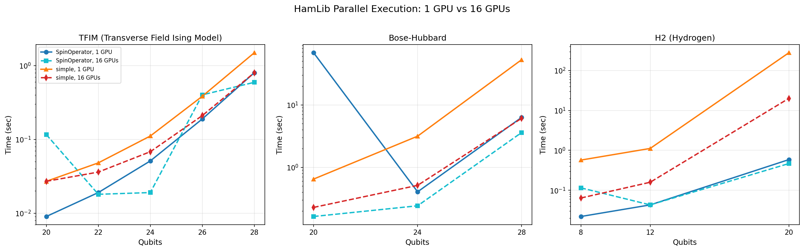
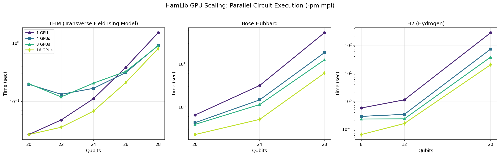
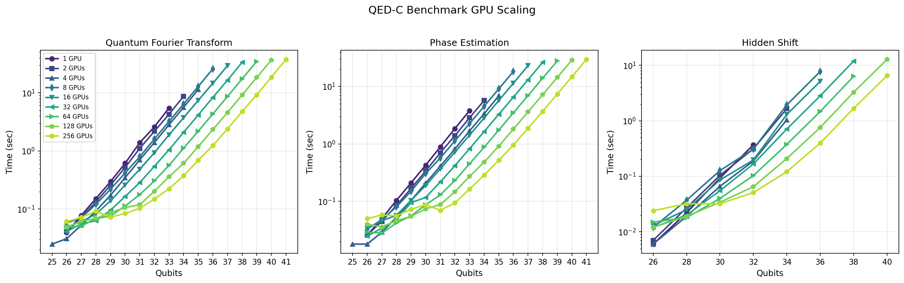

# CUDA-Q Parallel Execution Modes - Implementation Summary

**Date:** March 10, 2026
**Author:** TL
**Status:** Experimental - Further validation needed

---

## Background

The QED-C Hamiltonian Simulation benchmark supports multiple execution modes for CUDA-Q that leverage multi-GPU systems in different ways. This document summarizes recent work to implement and test parallel circuit execution across multiple GPUs.

### Hamiltonians Used

The Hamiltonians used in this benchmarking are part of the **QED-C Application-Oriented Benchmarks** suite and are extracted from the **NERSC HamLib** library of Hamiltonians. HamLib provides a standardized collection of Hamiltonians for quantum simulation benchmarking across different physical systems including condensed matter physics and quantum chemistry.

### Execution Modes

There are two fundamentally different approaches to utilizing multiple GPUs:

#### 1. mgpu Mode (State Vector Distribution)

When running with MPI (`-m mpi4py`) without the `--gpus_per_circuit` flag, CUDA-Q uses **mgpu mode**. In this mode, all GPUs collaborate to simulate a single quantum circuit by distributing the state vector across GPU memories. This is beneficial for:

- Large circuits that exceed single-GPU memory capacity
- Circuits where the state vector computation dominates execution time
- The `SpinOperator` method which uses CUDA-Q's native `observe()` function

The state vector is partitioned across GPUs, and MPI handles communication between them during gate operations.

#### 2. Parallel Circuit Execution (--gpus_per_circuit 1)

When running with MPI and `--gpus_per_circuit 1` (`-gpc 1`), circuits are **distributed across MPI ranks** for independent parallel execution. Each rank executes a subset of circuits on its assigned GPU, and results are gathered to rank 0. This is beneficial for:

- Workloads with many independent circuits (e.g., Pauli term sampling)
- Circuits small enough to fit on a single GPU
- The `simple` grouping method which creates multiple measurement circuits

This mode overrides mgpu and sets each rank to single-GPU execution.

### Observable Computation Methods

The benchmark also supports different methods for computing Hamiltonian expectation values:

| Method | Description | Circuits |
|--------|-------------|----------|
| `SpinOperator` | Uses CUDA-Q's native `observe()` with spin operators | 1 per evaluation |
| `simple` | Groups commuting Pauli terms, samples each group | N groups (varies by Hamiltonian) |

The `SpinOperator` method is more efficient but executes as a single operation. The `simple` sampling method creates multiple circuits that can benefit from parallel execution.

---

## Test Configuration

**System:** NERSC Perlmutter, 16 NVIDIA A100 GPUs (4 nodes × 4 GPUs)
**Qubit range:** 20 to 28 qubits
**Parameters:** K=1, time=0.1, 10000 shots

### Test Commands

```bash
# SpinOperator, Single GPU
python hamlib_simulation_benchmark.py -a cudaq -obs -n 20:28 -ham <hamiltonian> -g SpinOperator -k 1 -s 10000

# SpinOperator, mgpu mode (16 GPUs sharing memory for state vector)
srun -n 16 python -m mpi4py hamlib_simulation_benchmark.py -a cudaq -obs -n 20:28 -ham <hamiltonian> -g SpinOperator -k 1 -s 10000

# Simple sampling, Single GPU
python hamlib_simulation_benchmark.py -a cudaq -obs -n 20:28 -ham <hamiltonian> -g simple -k 1 -s 10000

# Simple sampling, parallel circuit execution (16 GPUs)
srun -n 16 python -m mpi4py hamlib_simulation_benchmark.py -a cudaq -obs -n 20:28 -ham <hamiltonian> -g simple -k 1 -s 10000 -gpc 1
```

---

## Results

### Test 1: TFIM Hamiltonian (16 GPUs)

**Hamiltonian:** `condensedmatter/tfim/tfim`
**Parameters:** 1D-grid:pbc, h:2

#### SpinOperator Method (Single Circuit, State Vector Parallelization)

| Qubits | Terms | Single GPU (sec) | mgpu 16 GPUs (sec) | Speedup |
|--------|-------|------------------|--------------------| --------|
| 20     | 40    | 0.431            | 0.115              | 3.7x    |
| 22     | 44    | 0.032            | 0.015              | 2.1x    |
| 24     | 48    | 0.051            | 0.016              | 3.2x    |
| 26     | 52    | 0.191            | 0.378              | **0.5x** |
| 28     | 56    | 0.842            | 0.607              | 1.4x    |

**Note:** mgpu is **slower** at 26 qubits - communication overhead dominates for mid-sized circuits.

#### Simple Sampling Method (Multiple Circuits, Parallel Execution)

| Qubits | Circuits | Single GPU (sec) | -gpc 1 16 GPUs (sec) | Speedup |
|--------|----------|------------------|-----------------------|---------|
| 20     | 2        | 0.422            | 0.228                 | 1.9x    |
| 22     | 2        | 0.184            | 0.117                 | 1.6x    |
| 24     | 2        | 0.267            | 0.172                 | 1.6x    |
| 26     | 2        | 0.555            | 0.310                 | 1.8x    |
| 28     | 2        | 1.699            | 0.898                 | 1.9x    |

**Note:** TFIM groups very efficiently into only 2 circuits, so only 2 of 16 GPUs have work. Maximum theoretical speedup is 2x.

---

### Test 2: Bose-Hubbard Hamiltonian (16 GPUs)

**Hamiltonian:** `condensedmatter/bosehubbard/BH_D-1_d-4`
**Parameters:** 1D-grid:nonpbc, enc:gray, U:10

#### SpinOperator Method (Single Circuit, State Vector Parallelization)

| Qubits | Terms | Single GPU (sec) | mgpu 16 GPUs (sec) | Speedup |
|--------|-------|------------------|--------------------| --------|
| 20     | 319   | 0.430            | 0.148              | 2.9x    |
| 24     | 389   | 0.405            | 0.244              | 1.7x    |
| 28     | 459   | 6.301            | 3.495              | 1.8x    |

#### Simple Sampling Method (Multiple Circuits, Parallel Execution)

| Qubits | Circuits | Single GPU (sec) | -gpc 1 16 GPUs (sec) | Speedup |
|--------|----------|------------------|-----------------------|---------|
| 20     | 11       | 0.996            | 0.428                 | 2.3x    |
| 24     | 9        | 3.636            | 0.805                 | 4.5x    |
| 28     | 9        | 53.541           | 6.503                 | **8.2x** |

**Note:** With 9-11 circuits distributed across 16 GPUs, efficiency improves as circuit execution time dominates over MPI overhead at larger qubit counts.

---

### Test 3: H2 (Hydrogen) Hamiltonian (16 GPUs)

**Hamiltonian:** `chemistry/electronic/standard/H2`
**Parameters:** ham_BK:
**Note:** Only 8, 12, and 20 qubit sizes available in HamLib for this Hamiltonian.

#### SpinOperator Method (Single Circuit, State Vector Parallelization)

| Qubits | Terms | Single GPU (sec) | mgpu 16 GPUs (sec) | Speedup |
|--------|-------|------------------|--------------------| --------|
| 8      | 185   | 0.342            | 0.141              | 2.4x    |
| 12     | 327   | 0.045            | 0.040              | 1.1x    |
| 20     | 2951  | 0.601            | 0.468              | 1.3x    |

#### Simple Sampling Method (Multiple Circuits, Parallel Execution)

| Qubits | Circuits | Single GPU (sec) | -gpc 1 16 GPUs (sec) | Speedup |
|--------|----------|------------------|-----------------------|---------|
| 8      | 54       | 0.917            | 0.230                 | 4.0x    |
| 12     | 59       | 1.127            | 0.188                 | 6.0x    |
| 20     | 1251     | 283.814          | 20.506                | **13.8x** |

**Note:** H2 at 20 qubits has 2951 Hamiltonian terms that group into 1251 circuits. With ~78 circuits per GPU, this workload achieves excellent parallel efficiency approaching the theoretical maximum of 16x.

---

### Summary Comparison at 28 Qubits

#### TFIM (simple structure, 2 circuit groups)

| Configuration | Time (sec) | Speedup | Notes |
|---------------|------------|---------|-------|
| SpinOperator, 1 GPU | 0.842 | - | Baseline |
| SpinOperator, mgpu 16 GPUs | 0.607 | 1.4x | State vector distributed |
| Simple, 1 GPU | 1.699 | - | 2 circuits sequential |
| Simple, -gpc 1 16 GPUs | 0.898 | 1.9x | 2 circuits parallel (max 2x possible) |

#### Bose-Hubbard (complex structure, 9 circuit groups)

| Configuration | Time (sec) | Speedup | Notes |
|---------------|------------|---------|-------|
| SpinOperator, 1 GPU | 6.301 | - | Baseline |
| SpinOperator, mgpu 16 GPUs | 3.495 | 1.8x | State vector distributed |
| Simple, 1 GPU | 53.541 | - | 9 circuits sequential |
| Simple, -gpc 1 16 GPUs | 6.503 | **8.2x** | 9 circuits parallel |

#### H2 at 20 Qubits (chemistry, 1251 circuit groups)

| Configuration | Time (sec) | Speedup | Notes |
|---------------|------------|---------|-------|
| SpinOperator, 1 GPU | 0.601 | - | Baseline |
| SpinOperator, mgpu 16 GPUs | 0.468 | 1.3x | State vector distributed |
| Simple, 1 GPU | 283.814 | - | 1251 circuits sequential |
| Simple, -gpc 1 16 GPUs | 20.506 | **13.8x** | 1251 circuits parallel (~78/GPU) |

---

## Key Findings

1. **SpinOperator + mgpu** provides modest speedup (1.1x-2.9x) but can be **slower** for mid-sized circuits (26 qubits TFIM) due to communication overhead.

2. **Simple + parallel execution (-gpc 1)** scales well when there are enough circuits to distribute:
   - TFIM: 1.9x speedup (only 2 circuits)
   - Bose-Hubbard: 8.2x speedup (9 circuits)
   - **H2: 13.8x speedup (1251 circuits)** - approaching theoretical 16x maximum

3. **Circuit count matters:** TFIM groups into only 2 circuits, limiting parallel speedup to 2x maximum. H2 chemistry Hamiltonians produce many more circuit groups (1251 at 20 qubits), enabling near-linear scaling with GPU count.

4. **Idle GPUs:** When circuits < GPUs, some ranks have no work. Distribution shows this clearly:
   ```
   Distribution: [(0,1), (1,1), ..., (8,1), (9,0), (9,0), ...] circuits per rank
   ```

---

## Observation: Anomalous mgpu Scaling at 26 Qubits (TFIM)

**Status: Needs further explanation**

The TFIM SpinOperator results show an unexpected pattern where mgpu mode is actually **slower** at 26 qubits:

| Qubits | State Vector Size | Single GPU (sec) | mgpu 16 GPUs (sec) | Speedup |
|--------|-------------------|------------------|--------------------| --------|
| 24     | 2^24 = 16M amps   | 0.051            | 0.016              | 3.2x    |
| 26     | 2^26 = 67M amps   | 0.191            | 0.378              | **0.5x** |
| 28     | 2^28 = 268M amps  | 0.842            | 0.607              | 1.4x    |

This result appears to be **reproducible** across multiple runs.

### Possible Explanation

At 26 qubits, the state vector may be in a "crossover zone" where:
- The state vector is large enough to require significant inter-node MPI communication (16 GPUs span 4 nodes on Perlmutter)
- The computation time (~0.2 sec) is not long enough to amortize this communication overhead
- At 28 qubits, computation time increases sufficiently that parallelization benefits outweigh communication costs

This pattern is characteristic of distributed computing where there exists a problem size range that is:
- Too large for efficient single-node execution
- Too small for multi-node computation to dominate over communication latency

### Why TFIM and not Bose-Hubbard?

TFIM has relatively few Hamiltonian terms (40-56) and shallow circuit depth, making the computation-to-communication ratio lower. Bose-Hubbard (300-450 terms, deeper circuits) has longer computation times that better amortize MPI overhead.

**Further investigation needed** to confirm this hypothesis and determine if this is specific to the TFIM structure or a general characteristic of mgpu scaling at certain qubit counts.

---

## Implementation Details

### Files Modified

| File | Changes |
|------|---------|
| `_common/cudaq/execute.py` | Added `_execute_parallel_mpi()`, `_get_block_indices()`, modified `execute_circuits_immed()` |
| `_common/qcb_mpi.py` | Added `gather()` and `scatter()` MPI wrapper functions |
| `hamlib/hamlib_simulation_benchmark.py` | Added `-gpc` CLI arg, leader check after parallel execution |
| `_common/qiskit/execute.py` | Added params for API compatibility |

### Key Implementation Notes

1. **Circuit Distribution:** Circuits are distributed in contiguous blocks across MPI ranks
2. **Target Override:** `--gpus_per_circuit 1` mode sets each rank to single-GPU target, overriding mgpu
3. **Result Gathering:** Results are gathered to rank 0 via `mpi.gather()`
4. **Leader Check:** Non-leader ranks skip result processing after `execute_circuits_enhanced()` returns

---

## Known Issues and Future Work

1. **Validation needed:** Further testing required to verify correctness across different Hamiltonians
2. **Load balancing:** Current contiguous distribution may not be optimal for varying circuit complexity
3. **Overhead:** MPI initialization and gather operations add overhead for small workloads
4. **Plotting:** Need to add data collection and visualization scripts for systematic benchmarking
5. **Hybrid mode:** Consider combining mgpu (for large circuits) with circuit parallelism

---

## Usage Summary

```bash
# For large circuits (state vector distribution):
srun -n 16 python -m mpi4py benchmark.py -a cudaq -g SpinOperator ...

# For many independent circuits (parallel execution):
srun -n 16 python -m mpi4py benchmark.py -a cudaq -g simple ... -gpc 1

# Single GPU baseline:
python benchmark.py -a cudaq ...
```

---

## Figures

The following figures are generated by `plot_parallel_execution.py` and stored in the `__images/` directory. Both PNG and PDF formats are produced for each figure.

### Mode Comparison Plots

These plots compare four execution configurations at a fixed GPU count, showing how different observable computation methods (SpinOperator vs. simple sampling) and parallelization strategies (single GPU vs. multi-GPU) affect execution time across varying qubit widths.

#### Figure: parallel_exec_combined



**Files:** `__images/parallel_exec_combined.png`, `__images/parallel_exec_combined.pdf`

**Caption:** Comparison of CUDA-Q execution modes for Hamiltonian simulation across three benchmark systems. Each subplot shows execution time (log scale) versus qubit count for four configurations: SpinOperator method on single GPU (baseline), SpinOperator with mgpu state-vector distribution, simple Pauli sampling on single GPU, and simple sampling with MPI parallel circuit execution. The TFIM Hamiltonian exhibits minimal benefit from circuit parallelism due to its efficient grouping into only 2 measurement circuits, while the H2 chemistry Hamiltonian with 1251 circuit groups demonstrates near-linear scaling with GPU count.

**Description:** This combined figure provides a side-by-side comparison of parallel execution performance across Hamiltonians of increasing complexity. The exponential growth in execution time with qubit count reflects the O(2^n) scaling of state vector simulation. The divergence between SpinOperator and simple sampling methods illustrates the trade-off between single-circuit efficiency and parallelization potential. For Hamiltonians that decompose into many Pauli term groups (e.g., H2 chemistry), the `-gpc 1` parallel execution mode substantially outperforms both single-GPU execution and mgpu state-vector distribution.

#### Individual Hamiltonian Plots

| Figure | Files | Description |
|--------|-------|-------------|
| TFIM | `parallel_exec_condensedmatter_tfim_tfim.{png,pdf}` | Transverse Field Ising Model with periodic boundary conditions. Simple structure yields only 2 circuit groups, limiting parallel speedup to 2x theoretical maximum. |
| Bose-Hubbard | `parallel_exec_condensedmatter_bosehubbard_BH_D-1_d-4.{png,pdf}` | 1D Bose-Hubbard model with gray encoding. Intermediate complexity with 9-11 circuit groups enables 8x speedup at 28 qubits. |
| H2 | `parallel_exec_chemistry_electronic_standard_H2.{png,pdf}` | Hydrogen molecule electronic structure Hamiltonian. High term count (2951 terms at 20 qubits) produces 1251 circuit groups, achieving 13.8x speedup on 16 GPUs. |

---

### GPU Scaling Plots

These plots focus specifically on the parallel circuit execution mode (`-gpc 1` with simple sampling), showing how execution time decreases as the number of GPUs increases from 1 to 16.

#### Figure: gpu_scaling_combined



**Files:** `__images/gpu_scaling_combined.png`, `__images/gpu_scaling_combined.pdf`

**Caption:** GPU scaling behavior for parallel circuit execution across three Hamiltonian benchmarks. Execution time (log scale) versus qubit count is shown for 1, 4, 8, and 16 GPU configurations using the simple Pauli sampling method with MPI-based circuit distribution. Scaling efficiency depends strongly on the number of independent circuit groups: TFIM (2 groups) shows minimal improvement beyond 2 GPUs, while H2 chemistry (hundreds to thousands of groups) approaches linear scaling with GPU count.

**Description:** The GPU scaling plots reveal the relationship between workload parallelism and multi-GPU efficiency. For the simple sampling method, each commuting group of Pauli terms requires a separate measurement circuit. These circuits are distributed across MPI ranks, with each rank executing its assigned circuits on a dedicated GPU. When the number of circuits exceeds the GPU count, work is evenly distributed and near-linear speedup is achieved. However, when circuits are fewer than GPUs (as with TFIM's 2 groups), most GPUs remain idle and speedup is bounded by the circuit count. This behavior has important implications for algorithm design: Hamiltonians or variational ansätze that produce many independent measurement circuits are better suited to multi-GPU parallel execution.

#### Individual Hamiltonian Scaling Plots

| Figure | Files | Scaling Behavior |
|--------|-------|------------------|
| TFIM | `gpu_scaling_condensedmatter_tfim_tfim.{png,pdf}` | Flat scaling beyond 2 GPUs due to only 2 circuit groups. Maximum theoretical speedup: 2x. |
| Bose-Hubbard | `gpu_scaling_condensedmatter_bosehubbard_BH_D-1_d-4.{png,pdf}` | Good scaling up to 8-16 GPUs. With 9-11 circuit groups, achieves ~8x speedup on 16 GPUs. |
| H2 | `gpu_scaling_chemistry_electronic_standard_H2.{png,pdf}` | Near-linear scaling. With 1251 circuit groups at 20 qubits (~78 circuits per GPU), achieves 13.8x speedup approaching the 16x theoretical limit. |

---

### Interpretation for Paper

**Key observations for discussion:**

1. **Parallelization strategy depends on Hamiltonian structure:** The number of commuting Pauli term groups determines the maximum achievable speedup. Simple physical models (TFIM) group efficiently into few circuits, while chemistry Hamiltonians with many-body interactions produce numerous groups amenable to parallel execution.

2. **Crossover between parallelization modes:** For Hamiltonians with few circuit groups, mgpu state-vector distribution may provide better performance than circuit-level parallelism. The optimal strategy depends on both circuit count and individual circuit complexity.

3. **Scaling efficiency metric:** The ratio of observed speedup to theoretical maximum (number of circuits or GPUs, whichever is smaller) provides a measure of parallel efficiency. H2 at 20 qubits achieves 13.8x/16x = 86% efficiency, indicating low MPI overhead for this workload.

4. **Implications for variational algorithms:** VQE and QAOA implementations that evaluate many Pauli terms per iteration can leverage circuit-level parallelism to reduce wall-clock time proportionally to available GPUs, provided the ansatz generates sufficient measurement circuits.

---

---

## QED-C Benchmark GPU Scaling

In addition to the HamLib Hamiltonian simulation benchmarks, we evaluated GPU scaling performance across the standard QED-C application-oriented benchmarks. These benchmarks represent common quantum algorithm primitives and provide insight into how different circuit structures scale with increasing GPU resources.

### Benchmarks Evaluated

| Benchmark | Description | Circuit Characteristics |
|-----------|-------------|------------------------|
| **Quantum Fourier Transform (QFT)** | Core subroutine for phase estimation and many quantum algorithms | Deep circuit with O(n²) two-qubit gates; highly structured |
| **Phase Estimation** | Estimates eigenvalues of unitary operators | Uses QFT as subroutine; controlled rotations |
| **Hidden Shift** | Determines hidden shift in bent functions | Hadamard-heavy; demonstrates quantum advantage for specific oracle problems |

### Test Configuration

**System:** NERSC Perlmutter
**GPU counts:** 1, 2, 4, 8, 16, 32, 64, 128, 256 GPUs
**Mode:** mgpu state-vector distribution (GPUs share memory for larger qubit simulations)
**Qubit range:** Varies by benchmark and GPU count (higher GPU counts enable larger simulations)

### Figure: benchmark_scaling_combined



**Files:** `__images/benchmark_scaling_combined.png`, `__images/benchmark_scaling_combined.pdf`

**Caption:** GPU scaling behavior for QED-C application-oriented benchmarks using CUDA-Q mgpu mode. Each subplot shows execution time (log scale) versus qubit count for GPU configurations ranging from 1 to 256 GPUs. The mgpu mode distributes the quantum state vector across GPU memories, enabling simulation of larger qubit counts than possible on a single GPU. Execution time grows exponentially with qubit count (reflecting O(2^n) state vector size), while increasing GPU count shifts the curves downward, indicating reduced execution time for fixed qubit width.

**Description:** These benchmarks utilize CUDA-Q's mgpu mode, where multiple GPUs collaborate to simulate a single quantum circuit by distributing the state vector across their combined memory. Unlike the parallel circuit execution mode used for Hamiltonian simulation (where independent circuits run on separate GPUs), mgpu mode accelerates individual circuit execution through distributed state vector operations. The scaling behavior reflects both the computational speedup from parallel gate application and the communication overhead of synchronizing state vector partitions across GPUs. For deep circuits like QFT and Phase Estimation, the computation-to-communication ratio is favorable, yielding good scaling efficiency.

### Individual Benchmark Plots

| Figure | Files | Notes |
|--------|-------|-------|
| QFT | `benchmark_scaling_quantum_fourier_transform.{png,pdf}` | Deep circuit with many controlled rotations; benefits from mgpu parallelization |
| Phase Estimation | `benchmark_scaling_phase_estimation.{png,pdf}` | Builds on QFT; similar scaling characteristics |
| Hidden Shift | `benchmark_scaling_hidden_shift.{png,pdf}` | Hadamard-dominated circuit; efficient gate parallelization |

### Interpretation

**Key observations:**

1. **Exponential scaling with qubits:** All benchmarks show the expected exponential growth in execution time with qubit count, reflecting the O(2^n) state vector size for n-qubit simulation.

2. **Linear speedup with GPUs:** For sufficiently large circuits, doubling the GPU count approximately halves execution time, indicating efficient state vector distribution and minimal communication overhead.

3. **Minimum efficient problem size:** Very small qubit counts show diminishing returns from additional GPUs, as communication overhead dominates. The crossover point depends on circuit depth and GPU interconnect bandwidth.

4. **Extended qubit reach:** The primary benefit of mgpu mode is enabling simulation of larger qubit counts. With 256 GPUs, qubit counts that would exhaust single-GPU memory become tractable.

5. **Circuit structure matters:** Circuits with regular structure (like QFT's controlled rotation pattern) may exhibit better cache behavior and more predictable communication patterns than irregular circuits.

---

## Raw Data Files

### HamLib Observable Benchmarks
- `tt-tfim.txt` - TFIM benchmark output
- `tt-bh.txt` - Bose-Hubbard benchmark output
- `tt-h2.txt` - H2 (Hydrogen) chemistry benchmark output

### QED-C Benchmark Scaling
- `__data/DATA-nvidia-1g-1.json` - Single GPU results
- `__data/DATA-nvidia-2g-1.json` through `DATA-nvidia-256g-1.json` - Multi-GPU results
